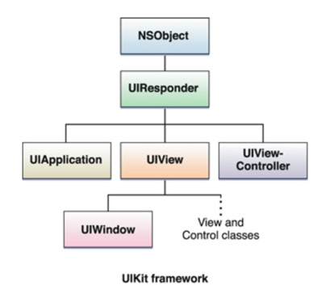
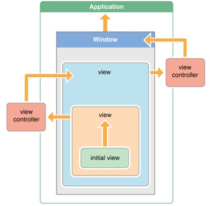

autoscale: true
build-lists: true
# W2D5
* TextInput
* UITextField
* UITextView
* TextInput Delegates
* Customizing TextInput Views
* UIWebView, WKWebView, SFSafariViewController
* Custom Drawing With Core Graphics & UIBezierPath

---

# Text Input

UIKit offers 2 ways to input text

1. UITextField: single lines
2. UITextView: multiple lines

* `UITextView` inherits from `UIScrollView`.
* Delegates are important for interacting with text input controls.
* These inputs conform to the `UITextInputTraits` protocol which allows you to customize the keyboard type.

---
# UIResponder

* Both UITextField & UITextView inherit from UIResponder
* Let’s talk about responders in iOS.
* All responder objects inherit from the class UIResponder
* Any instance that inherits from UIResponder can handle events, like, touch events, motion events, presses (from accessories).
* Visible elements of an app are almost always responders. e.g. all subclasses of UIViews, controls (like UIButton).
* ViewControllers, the UIApplication are responders.
* The AppDelegate is a also a subclass of UIResponder.

---

---

# Responder Chain
* If a responder cannot handle an event it _automatically_  forwards it to the "next responder" in a linked series called the **responder chain**.

---

# Responder Chain

* The **Responder Chain** will always mark one responder as the `First Responder` and one as the `Next Responder`.
* The responder chain allows flexibility in handling events. (How so?).
* Events travel up the chain starting at the leaf most responder.
* If nothing overrides the event in question it is forwarded to the next responder in the chain until the final responder in the chain the UIApplication (unless we override UIApplication (don't)).
* If UIApplication delegate doesn't handle it then the event is just discarded.

---
# userInteractionEnabled

* _userInteractionEnabled_ is a property on UIView (or subclasses) that determines whether a view receives interactions. By default this is set to `YES` for `UIView`s. 
* But most subclasses of UIView (like `UIImageView`, `UILabel`, etc.) set _userInteractionEnabled_ to `NO` by default. 
* So, if you want a `UIImageView` to handle a touch event you must always set the _userInteractionEnabled_ to `YES`. (This is a common beginner gotcha).

---
# UIWebView / WKWebView

* `UIWebView` is a crippled version of Safari that you ~~can~~ just drop into your view controller.
* Apple says "In apps that run in iOS 8 and later, use the `WKWebView` class instead of using `UIWebView`." It is marked as deprecated in IB.
* `WKWebView` is much faster and more flexible. As of Xcode 9.0.1 it has IB support! 🙌🏻
* You can use webviews for displaying web pages (obviously!)
* You can also load web content from other sources, like a data base, or network endpoint.
* You can interact with web content using javascript and do things like make content editable using _contentEditable_. 
* So, you can make things like a blog editor from a webview.

--- 

# SFSafariViewController

* For just displaying web content in your app prefer `SFSafariViewController`.
* `SFSafariViewController` "includes Safari features such as Reader, AutoFill, Fraudulent Website Detection, and content blocking. It shares cookies and other website data with Safari".
* "If your app lets users view websites from anywhere on the Internet, use the `SFSafariViewController` class. If your app customizes, interacts with, or controls the display of web content, use the WKWebView class."
* Many apps now use `SFSafariViewController`, for instance Twitter.
